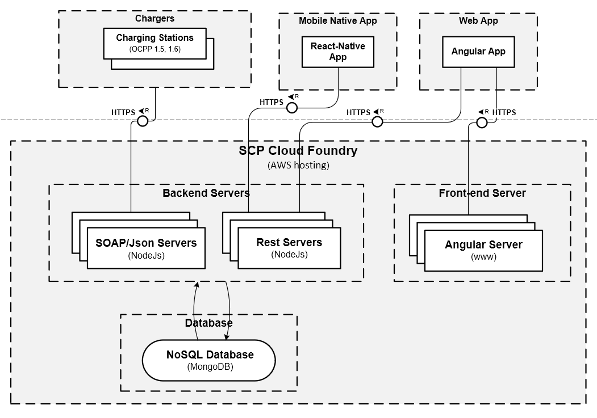

# Open e-Mobility NodeJs Server

## Summary

This application server (NodeJs) collects and stores the data (MongoDB) received from the Charging Stations via the OCPP protocol and exposes a REST service to an Angular front-end dashboard application ([Open e-Mobility Angular Dashboard](https://github.com/sap-labs-france/ev-dashboard)).

The application features:

* Charging Stations details and real-time statuses
* Charging sessions curves in real time
* Charging stations remote control (Reboot, Clear Cache, Stop Transaction, Unlock Connector)
* Charging Station Template management: Zero configuration
* User management
* Badge management
* Role management (ABAC)
* Static Energy Management: Manually limit the charging station
* Smart Charging with Assets, Fair Sharing, Peak Shaving, Cost Management and Phase Balancing
* Realtime Asset Management (Building, Battery, Solar Panel) 
* Billing with Stripe
* Complex Pricing
* Roaming integration (Gire, Hubject)
* Refunding (SAP Concur)
* Simple Statistics + Advanced Analytics (SAP Analytics)
* Car Connector Management (Get the car's data to optimize the charging session)

**Contact the author** <a href="https://www.linkedin.com/in/serge-fabiano-a420a218/" target="_blank">Serge FABIANO</a>

## Installation

* Install NodeJS: https://nodejs.org/ (install the LTS version)
* Install Python: https://www.python.org/ (needed by node-gyp)
* Install MongoDB: https://www.mongodb.com/
* Clone this GitHub project
* Install required build tools:
  * Under Windows as an administrator:
    ```powershell
    npm install --global --production windows-build-tools
    ```
  * Under Mac OS X, install Xcode from the Apple store
  * Under Debian based GNU/Linux distribution:
    ```shell
    sudo apt install build-essential
    ```
* Go into the **ev-server** directory and run **npm install** or **yarn install**

**NOTE**:
* On Windows with **chocolatey** (https://chocolatey.org/), do as an administrator:

```powershell
choco install -y nodejs-lts mongodb python postman robot3t microsoft-build-tools
```

* On Mac OSX with **Homebrew** (https://brew.sh/), do:

```shell
brew tap mongodb/brew
brew install node mongodb-community@4.4 python@3.9 postman robo-3t
```

* Follow the rest of the setup below

## The Database

#### Start MongoDB

##### Manually

```shell
mongod --port <port> --dbpath <path> --replSet <replcaSetName>
```
For instance:
```shell
mongod --port 27017 --dbpath "/var/lib/mongodb" --replSet "rs0"
```

##### As a Windows service

Add to /path/to/mongod.cfg (open -a TextEdit /usr/local/etc/mongod.cfg)
```yaml
...
replication:
  replSetName: "rs0"
...
```
Restart the MongoDB service with Powershell as an administrator:

```powershell
Restart-Service -Name "MongoDB"
```

#### Activate the Replica Set

Activate the replica set:

- Start the Mongo client
```shell
mongo
```

- Activate the Replica Set
```js
rs.initiate()
```

Check here for more info:
[Mongo DB Replica Set](https://docs.mongodb.com/manual/tutorial/convert-standalone-to-replica-set/)

#### Create the Admin user

This user will be used to connect to the database as an administrator with tools like MongoDB shell or RoboMongo:

Create Admin User on Admin schema:
```js
  use admin
  db.createUser({
    user: "evse-admin",
    pwd: "<YourPassword>",
    roles: [
      "read",
      "readWrite",
      "dbAdmin",
      "userAdmin",
      "clusterAdmin",
      "readAnyDatabase",
      "readWriteAnyDatabase",
      "userAdminAnyDatabase",
      "dbAdminAnyDatabase"
    ],
    passwordDigestor: "server"
  })
```

#### Restart MongoDB with authentication enabled

##### Manually

This will restart MongoDB and will accept only authenticated connections from now:

```shell
mongod --auth --port <port> --dbpath <path> --replSet <replcaSetName>
```

##### As a Windows service

Add to /path/to/mongod.cfg:
```yaml
...
security:
  authorization: enabled
...
```

Restart the MongoDB service with Powershell as an administrator:

```powershell
Restart-Service -Name "MongoDB"
```

#### Create the Application User

Connect using the admin user

```shell
mongo -u evse-admin -p <YourPassword> --authenticationDatabase admin
```

Create Application User on EVSE schema
```js
  use evse
  db.createUser({
    user: "evse-user",
    pwd: "<YourPassword>",
    roles: [
      "readWrite"
    ],
    passwordDigestor: "server"
  })
```

Now your database is ready to be used.

**NOTE**: You can also use empty-db.zip or empty-db-service.zip on the share to do the initial setup of the databases required by simply deleting all files in the MongoDB databases path and then dropping its content inside instead.

## The Application Server

The application server consists of:

* **Central Service Server**: Serves the charging stations
* **Central Service REST Server**: Serves the Angular front-end dashboard

### The Central Service Server (CSS)

This application server will listen to the charging stations and store the data exchanged into to the database.

It can also communicate with the charging stations (reboot, stop a transaction...)

The protocol used by this application server is OCPP (Open Charge Point Protocol) in version 1.2, 1.5 and 1.6 (OCPP-S or OCPP-J).

Other protocols, like the ISO 15118, or OCPP version 2.0 will also be supported in the future.

#### Configuration

In **src/assets** folder there are two templates already provided named **config-template-http.json** for HTTP and **config-template-https.json** for HTTPS.

Choose one and rename it to **config.json**.

#### Listen to the Charging Stations

Set the protocol, host and the port which you want the server to listen to:

SOAP (OCPP-S):
```json
  "CentralSystems": [
    {
      "implementation": "soap",
      "protocol": "http",
      "host": "localhost",
      "port": 8000
    }
  ]
```

JSON (OCPP-J):
```json
  "CentralSystems": [
    {
      "implementation": "json",
      "protocol": "ws",
      "host": "localhost",
      "port": 8010
    }
  ]
```

There can be several central systems with different protocols.

### The Central Service REST Server (CSRS)

The server also exposes a set of REST services to serve the front-end [Angular Dashboard](https://github.com/sap-labs-france/ev-dashboard).

This application displays the charging stations with their statuses, charging curves, user management...

To set the end point, fill the following information in the **config.json** file

#### Configuration

```json
  "CentralSystemRestService": {
    "protocol": "http",
    "host": "YOUR_HOST",
    "port": 80,
		"userTokenKey": "YOUR_JWT_PRIVATE_KEY",
    "userTokenLifetimeHours": 12,
    "userDemoTokenLifetimeDays": 360,
    "userTechnicalTokenLifetimeDays": 180,
    "passwordWrongNumberOfTrial": 3,
    "passwordBlockedWaitTimeMin": 5,
    "captchaSecretKey": "YOUR_CAPTCHA_SECRET",
    "debug": false
  }
```

In order to properly call the REST endpoints, both ev-server and clients (ev-dashboard, ev-mobile, etc.) must reference a Google reCaptcha key. You can refer to this link https://www.google.com/recaptcha/admin/create, then copy the server key in config.json file, in section CentralSystemRestService:

```json
    ...
    "captchaSecretKey": "<GOOGLE_RECAPTCHA_KEY_SERVER>"
    ...
```
### Central Service Server (CSS) > Database

You have now to connect the server to the database.

#### Configuration

Database connection info:

```json
  "Storage": {
    "implementation": "mongodb",
    "host": "localhost",
    "port": 27017,
    "user": "evse-user",
    "password": "YourPassword",
    "database" : "evse"
  }
```

### Front-End

When the user will be notified (by email for instance), a link to the front-end application will be built based on the configuration below:

```json
  "CentralSystemFrontEnd": {
    "protocol": "https",
    "host": "localhost",
    "port": 8080
  }
```

### Notifications

The user will receive a notification when, for instance, his vehicle will be fully charged.

Only notification via emails is implemented today.

#### Email Notification

Edit the following info:

```json
  "Email": {
    "smtp": {
      "from": "evse.adm.noreply@gmail.com",
      "host": "smtp.gmail.com",
      "port": 465,
      "secure": true,
      "requireTLS": true,
      "type": "login",
      "user": "YourEmailUser",
      "password": "YourEmailPassword",
      "debug": false
    }
  }
```

### Users

#### Authentication

The authentication is done via user login/password and the server will deliver a token that will expire after a certain period of time.

Then there are neither session nor cookies sent around and this will allow to scale easily.

The token key is provided is the **config.json** file:

```json
  "CentralSystemRestService": {
    ...
    "userTokenKey": "MySecureKeyToEncodeTokenAuth",
    "userTokenLifetimeHours": 12,
    "userDemoTokenLifetimeDays": 365,
    "userTechnicalTokenLifetimeDays": 365,
    ...
  }
```

You can set your own key to encode it in key **userTokenKey** and change its lifetime in **userTokenLifetimeHours** (12 hours by default.)

The Demo users can have a longer lifetime for demo purposes with key **userDemoTokenLifetimeDays** (365 days by default)


#### Authorization

The users can have differents roles:
* SuperAdmin (**S**)
* Admin (**A**)
* Basic (**B**)
* Demo (**D**)

##### Authorization Matrix

|                  |            SuperAdmin          |                                                       Admin                                                       |                   Basic                 |      Demo     |
|------------------|:------------------------------:|:-----------------------------------------------------------------------------------------------------------------:|:---------------------------------------:|:-------------:|
| Users            |                                |                                                        List                                                       |                    -                    |       -       |
| User             |                                |                                        Create, Read, Update, Delete, Logout                                       | Read, Update (Only logged user), Logout | (user hidden) |
| ChargingStations |                                |                                                        List                                                       |                   List                  |      List     |
| ChargingStation  |                                | Read, Update, Delete, Reset, ClearCache,  GetConfiguration, ChangeConfiguration, StopTransaction, UnlockConnector |                   Read                  |      Read     |
| Logging          |               List             |                                                        List                                                       |                    -                    |               |
| Tenant           |  Create, Read, Update, Delete  |                                                                                                                   |                    -                    |               |

### Notifications

The user will receive a notification when, for instance, his vehicle will be fully charged.

#### Email Notification

Set the following info:

```json
  "Email": {
    "smtp": {
      "from": "evse.adm.noreply@gmail.com",
      "host": "smtp.gmail.com",
      "port": 465,
      "secure": true,
      "requireTLS": true,
      "type": "login",
      "user": "YourEmailUser",
      "password": "YourEmailPassword",
      "debug": false
    }
  }
```

### Charging Station Parameters

Here are the charging station parameters:

```json
  "ChargingStation": {
    "heartbeatIntervalSecs": 60,
    "checkEndOfChargeNotificationAfterMin": 5,
    "notifBeforeEndOfChargePercent": 50,
    "notifBeforeEndOfChargeEnabled": false,
    "notifEndOfChargePercent": 0,
    "notifEndOfChargeEnabled": true,
    "notifStopTransactionAndUnlockConnector": false
  },
```

* **heartbeatIntervalSecs**: The time interval which the charging station will send the data to the server
* **checkEndOfChargeNotificationAfterMin**: The delay to wait before the notification will be sent when the charge will be finished
* **notifBeforeEndOfChargePercent**: The threshold for the intermediate notification  (% of the energy delivered by the charging station)
* **notifBeforeEndOfChargeEnabled**: Enable the intermediate notification
* **notifEndOfChargePercent**: The threshold for the end of charge (% of the energy delivered by the charging station)
* **notifEndOfChargeEnabled**: Enable the end of charge notification
* **notifStopTransactionAndUnlockConnector**: Enable the stop transaction and unlock of the connector when the charge will be finished

### Internationalization

Here are the default delivered locales:

```json
  "Locales": {
    "default": "en_US",
    "supported": [
      "en_US",
      "fr_FR",
      "es_ES",
      "de_DE",
      "pt_PT",
      "it_IT",
    ]
  },
```

## The Charging Stations

Each charging station vendor has its own configuration interface, so I'll just describe in general terms what's to be setup on those:

* Set this server URL in the charging station's interface
* Rename the charging station ID if necessary: this will be the key (use Company-Town-Number)
* Set the charging station endpoint public URL to a reachable URL so the server can use it to trigger action on it (avoid using *localhost*)

All charging stations supporting OCPP-J and OCPP-S version 1.5 and 1.6 protocols are compatibles.

## Start the Central Service Server (CSS)

### Production Mode

Start the application:

```shell
npm run start
```

You can also start the application with the standard nodejs profiler:

```shell
npm run start:prod:prof
```

### Development Mode

In a console, start the application (rebuild and restarts if any changes is detected):

```shell
npm run start:dev
```

You can also start the application with the standard nodejs profiler:

```shell
npm run start:dev:prof
```

### Profiling with [clinic](https://clinicjs.org)

```shell
npm run start:(prod|dev):(doctorprof|flameprof|bubbleprof)
```

**NOTE**: You can also use the files in the ev-config-scripts.zip on the share to have a correct initial setup of your development environment and some server startup helpers.

### Tests
**Prerequisite:** The database must contain an admin user.

* Create a local configuration file located in './test/config/local.json' from the template file './test/config-template.json' with the parameters to override like

```json
        {
          "superadmin": {
            "username": "YOUR_SUPERADMIN_USERNAME",
            "password": "YOUR_SUPERADMIN_PASSWORD"
          },
          "admin": {
            "username": "YOUR_ADMIN_USERNAME",
            "password": "YOUR_ADMIN_PASSWORD"
          },
          "server": {
            "logs": "json"
          },
          "ocpp": {
            "json": {
                "logs": "json"
            }
          }
        }
```

  For further parameters, check the [`config`](./test/config.js) content. It is also possible to use environment variables as defined in the [`config`](./test/config.js) file
* Start a server containing the configured admin user in the database
* If you have not done it yet, run the command `npm run test:createContext`
* Run the command `npm run test`

### Docker Mode
Depending on the need it is possible to start different docker containers.

Each following command has to be executed in folder [docker](./docker).

#### Minimal local environment
It consist in starting a pre configured empty mongo database plus a mail service and mongo express.
To start it, execute command:
```bash
make local-env
```
To stop it, execute command:
```bash
make clean-local-env-containers
```
The mongo database folder will be kept along multiple restarts. To remove it:
```bash
make clean-mongo-data
```
Due to fixed replica set configuration, the database hostname has to be referenced in the host machine to be accessible.
To enable it, as admin, add the entry `ev_mongo 127.0.0.1` in `/private/etc/hosts` for MacOSX or in `C:\Windows\System32\Drivers\etc\hosts` for Windows.

The database is then accessible using the credential `evse-admin/evse-admin-pwd`.
The default login/password on the master tenant is super.admin@ev.com/Super.admin00. The default login/password on the SLF tenant is slf.admin@ev.com/Slf.admin00.

#### ev-server
In case of UI development or test purpose, the server has been containerized.
To start it, execute command:
```bash
make server
```
In order to rebuild the image in case of changes:
```bash
make server-force
```
To stop it, execute command:
```bash
make clean-server-container
```

#### mongo express
If needed, it is possible to start or stop a [mongo express](https://github.com/mongo-express/mongo-express) instance auto connected to mongodb independently.
To start it, execute command:
```bash
make mongo-express
```

To stop it, execute command:
```bash
make clean-mongo-express-container
```

#### All in one
It is possible to build and start all containers in one command:
```bash
make
```
Or without the optional git submodules:
```bash
make SUBMODULES_INIT=false
```
That Makefile option works for all targets.

## Architecture

### TAM Model


## License

This file and all other files in this repository are licensed under the Apache Software License, v.2 and copyrighted under the copyright in [NOTICE](NOTICE) file, except as noted otherwise in the [LICENSE](LICENSE) file.

Please note that Docker images can contain other software which may be licensed under different licenses. This LICENSE and NOTICE files are also included in the Docker image. For any usage of built Docker images please make sure to check the licenses of the artifacts contained in the images.
